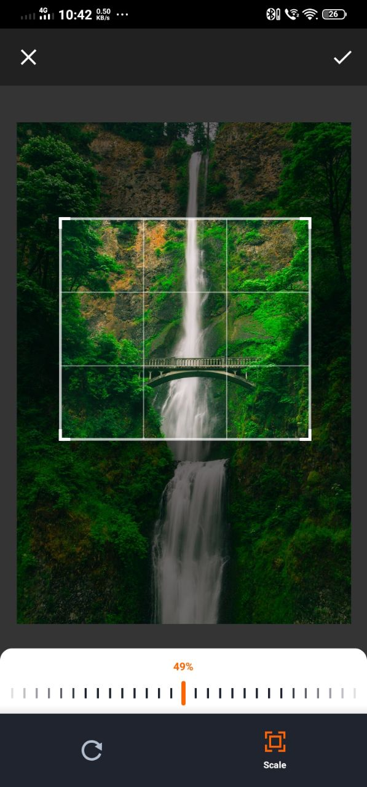
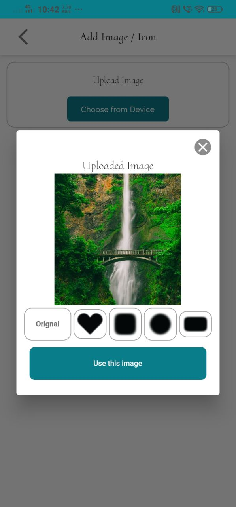
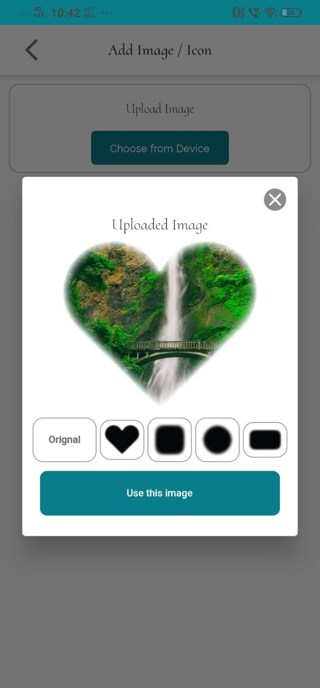
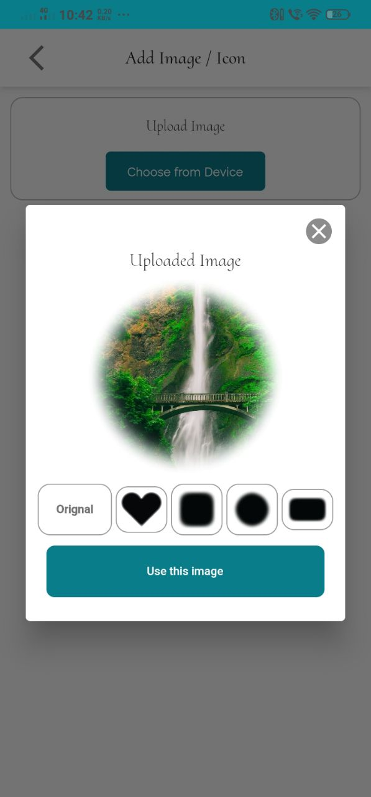
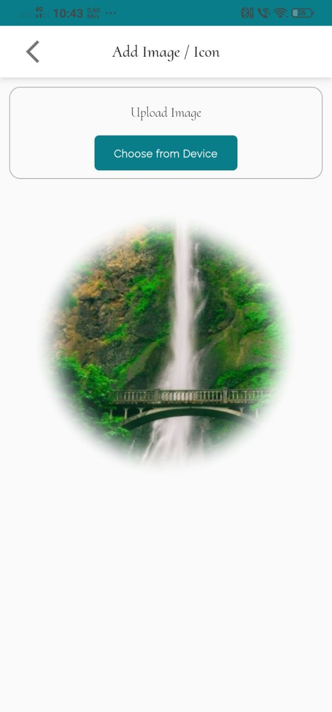

# Image Frame

This is a simple app where we can access the local device image and change the frame. We can see the change on the main page.

## Screenshots

<table>
<tr>
<td></td>
<td></td>
<td></td>
</tr>
<tr>
<td></td>
<td></td>
<td></td>
</tr>
</table>
